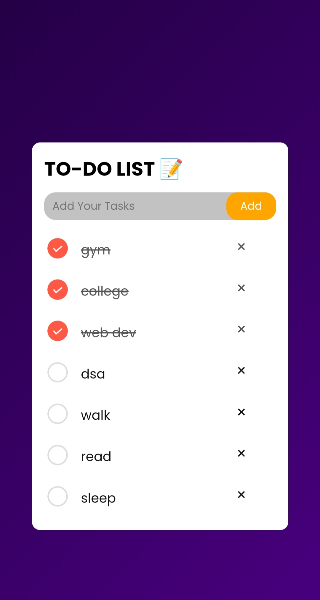

# To-Do List

A simple and responsive To-Do List web app built using **frontend** and **backend**.  
This project was developed and tested directly on a mobile device, so appearance and interactions are optimized for phones.

## Features

- Add new tasks quickly
- Mark tasks as completed
- Delete tasks
- Simple and clean UI
- Works on mobile browsers

## How to Use

1. **Add a Task:**  
   Enter your task in the input box and press the "Add" button.

2. **Complete a Task:**  
   Tap on a task to mark it as completed.

3. **Delete a Task:**  
   Press the delete button next to any task to remove it.

## Notes

- The UI and interactions are designed for mobile users, so layouts may differ on desktop devices.
- This mini project helped me learn and practice frontend and backend connection and api routes.

## License

This project is open source and available for learning purposes.
